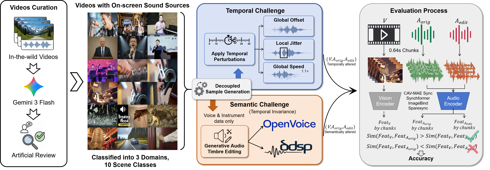

# AV-SyncBench 复现与评测



本目录提供 AV-SyncBench（Interspeech 2026）从数据下载、样本校验、模型下载、
预处理到结果汇总的完整复现入口。目前给出两套完整评测代码：

- **Synchformer VGGSound**：以 21 类偏移分类头的 `p(delta=0)` 作为同步分数；
- **ImageBind-Huge**：默认提供按作者侧代码审计实现的论文产表变换与打分模式
  `paper_legacy`（公开版视频解码统一替换为 Decord），并额外提供更贴近上游官方
  预处理的 `official_0p64` 模式；
  两者均按 0.64 秒切片计算逐段余弦相似度。

二者统一采用严格配对判定：原始样本分数必须大于扰动样本分数，平分记错。

论文：[Interspeech 2026 正式页面](https://www.isca-archive.org/interspeech_2026/zhou26g_interspeech.html)
（1137–1141，DOI: `10.21437/Interspeech.2026-2177`）·
[arXiv](https://arxiv.org/abs/2607.00726) ·
[数据集](https://modelscope.cn/datasets/coming245/AVSyncBench) ·
[项目主页](https://duck-boss.github.io/AV-SyncBench/)

## 推荐阅读顺序

1. [完整 Global Offset 教程](docs/REPRODUCE_GLOBAL_OFFSET.md)
2. [模型来源、checkpoint 与校验信息](docs/MODEL_ZOO.md)
3. [manifest 和输出格式](docs/DATA_FORMAT.md)
4. [常见复现差异排查](docs/TROUBLESHOOTING.md)
5. [协议来源与实现对应关系](docs/PROTOCOL_PROVENANCE.md)

## 两个模型 demo

```bash
python -m pip install -e .

# Demo 1：Synchformer VGGSound 偏移分类器
bash examples/run_synchformer_demo.sh

# Demo 2：ImageBind-Huge 音视频特征相似度
bash examples/run_imagebind_demo.sh
```

两个脚本均会在缺失时克隆固定 commit 的上游代码、生成闪烁方块与同步脉冲音、
制作一个 500 ms 延迟负样本、下载官方权重并完成一次评测。合成样本不含第三方
素材，只用于检查完整执行链路，不能作为论文结果。

## 与邮件复现问题直接相关的口径

- 论文使用 Synchformer 的 **VGGSound checkpoint
  `24-01-02T10-00-53`**；
- 输入统一为 25 FPS 视频、16 kHz 单声道音频；
- 模型一次输入为 5 秒，内部使用 14 个 0.64 秒片段、0.32 秒步长；公开适配器
  在视频层面每 0.64 秒启动一个 5 秒窗口，尾部补齐后对各窗口概率求均值；
- 不是看预测类别是否命中 50/100/200/300/500 ms，而是比较原始与负样本的
  `softmax(logits)[10]`；
- 已生成的负样本进入模型时 `offset_sec` 必须仍设为 `0.0`，否则会二次错位；
- 本评测环境严格固定为 `PyAV 9.0.0`，以避免解码版本差异。

每次运行都会生成 `*.run.json`，自动记录 checkpoint/config MD5、依赖版本、
窗口策略、聚合方式和评分定义，方便与外部复现者逐项对齐。

ImageBind 使用独立的 CUDA 12.6 / PyTorch 2.10 环境和 Decord 视频解码；不要
直接安装上游仓库中面向旧 PyTorch 的完整 requirements。具体命令及安全原因见
英文完整教程第 3 节。
